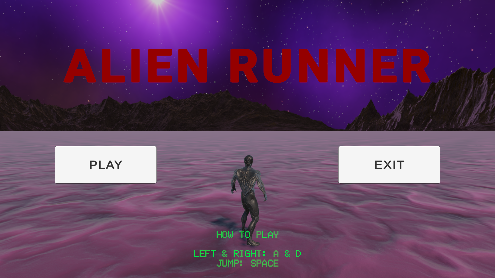
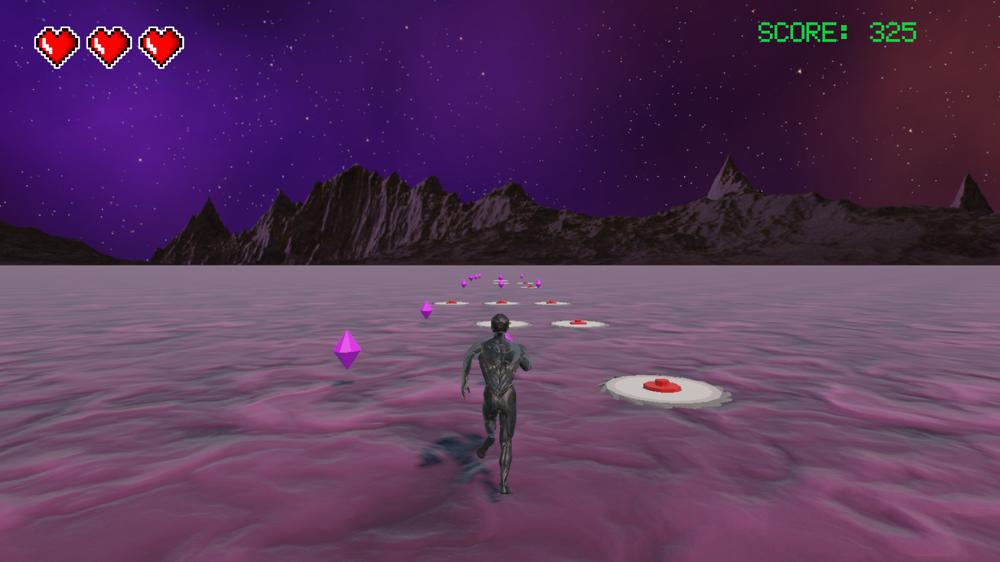
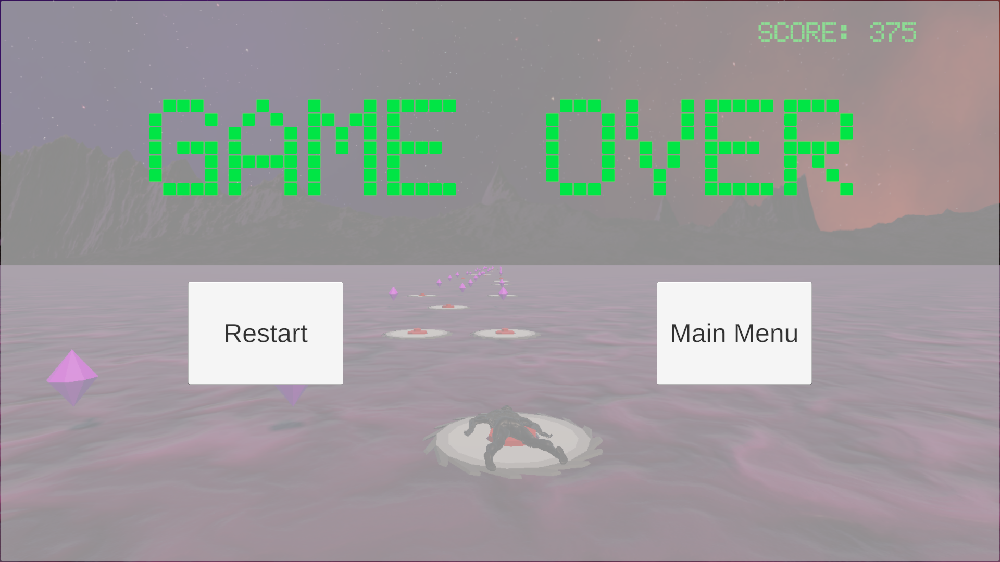

Alien Runner - Endless Runner

Alien Runner is my first complete Unity portfolio project, developed from scratch to strengthen my gameplay programming and Unity development skills.
The project focuses on creating a polished endless runner experience with clean gameplay systems, UI, animation, audio, and game flow.

Features

✅ Lane-based movement

✅ Jump mechanic

✅ Increasing movement speed

✅ Endless obstacle spawning

✅ Collectible diamonds

✅ Score system

✅ Health system (3 lives)

✅ Trap system

✅ Death & Stumble animations

✅ Main Menu

✅ Game Over Screen

✅ Sound Effects

✅ Background Music

Gameplay

Controls

A / D   → Move Left / Right

Space   → Jump

T       → Start Game

Technologies

✅ Unity 6
✅ C#
✅ Unity Animator
✅ Unity UI (uGUI)
✅ Unity Audio System
✅ Coroutines
✅ Git

What I learned

During this project I gained practical experience with:

Object-oriented programming in Unity
Animator Controller
Collision & Trigger systems
Audio implementation
Debugging gameplay issues
Coroutine based spawning
Scene Management
Audio Source Management
UI Programming
Game State Management

## Screenshots

### Main Menu

### Gameplay

### Game Over

Play Online

Unity Play

https://play.unity.com/en/games/d28a6c83-a9d7-4c52-9f35-c883347b7b0a/deneme

Source Code

https://github.com/parkdag/Alien-Runner-v1.0
